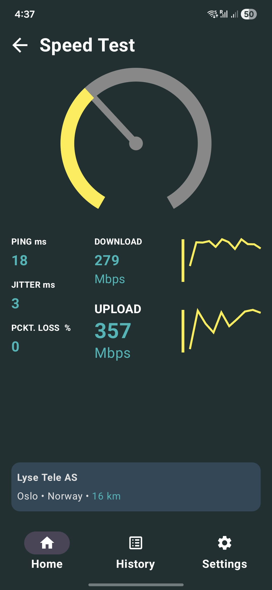
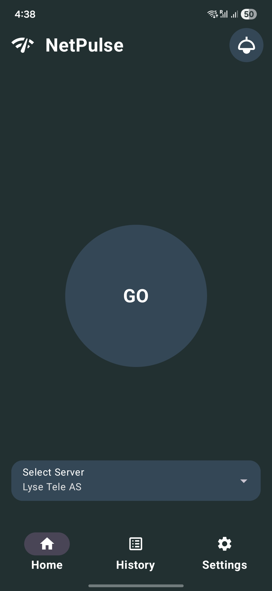
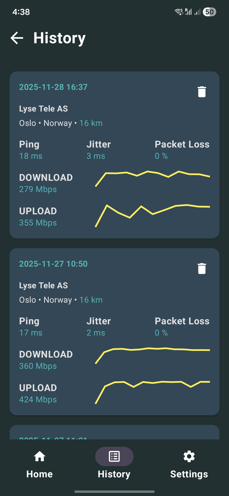
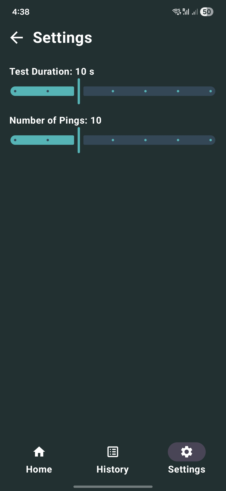
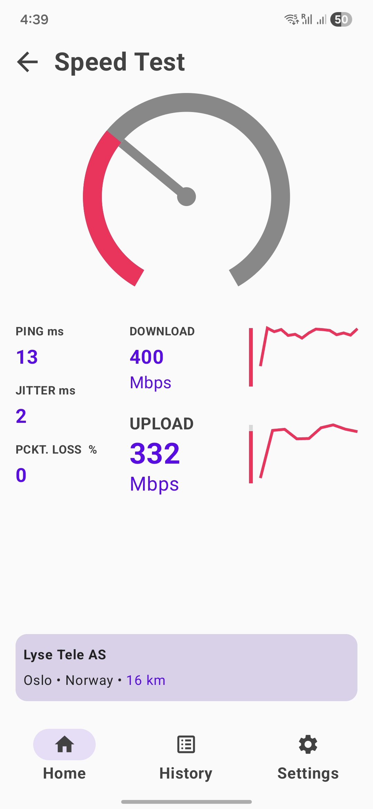
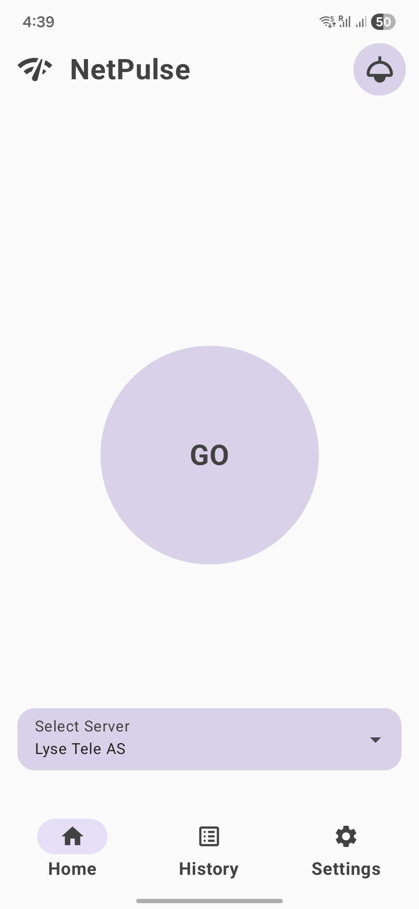
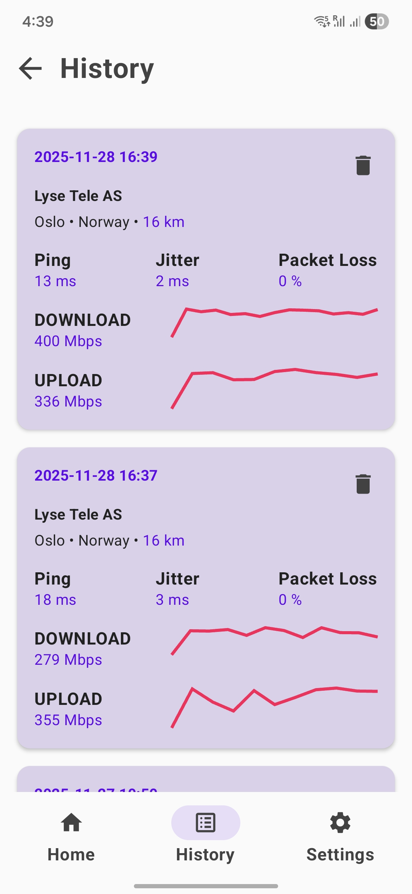
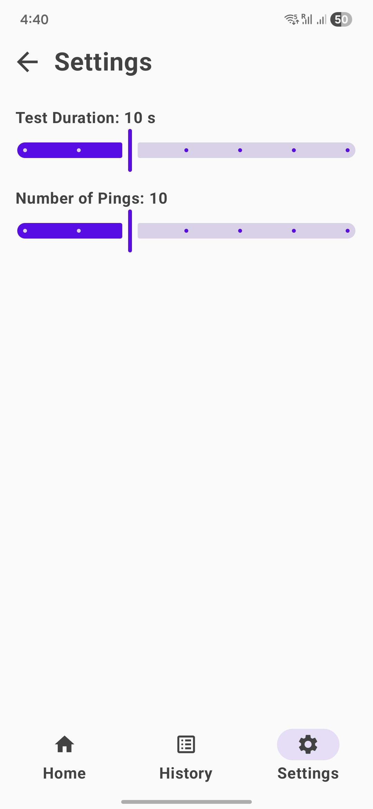

# NetPulse - KMP

**NetPulse** - KMP is a **Kotlin Multiplatform** project targeting Android, iOS and Desktop, built with Compose Multiplatform, Navigation Compose, Flow, Koin, Ktor, SqlDelight, DataStore, NSUserDefaults and Material3 based on MVVM architecture.

It is a app designed to help you find your current network speed.

## Features

- Tracking your download and upload network speed 
- Displaying Ping, Jitter and Packet Loss
- Configurable test duration and number of pings
- History screen to check and delete previous results
- Dark and Light theme

### Screenshots

    
&nbsp; &nbsp; &nbsp; &nbsp;
    
&nbsp; &nbsp; &nbsp; &nbsp;
    
&nbsp; &nbsp; &nbsp; &nbsp;
    
&nbsp; &nbsp; &nbsp; &nbsp;
    
&nbsp; &nbsp; &nbsp; &nbsp;
    
&nbsp; &nbsp; &nbsp; &nbsp;
    
&nbsp; &nbsp; &nbsp; &nbsp;
    

### Usage
On Home screen the closest server is selected by default. You can change it in Servers list drop down menu.
Click on GO button to start testing your network speed.
On History screen you can check and delete previous results.
On Settings screen you can change test duration and number of pings.
You can change app theme by using the icon at the top right on the Home screen.

## Tech Stack

This is a **Kotlin Multiplatform** project targeting Android, iOS and Desktop.

**NetPulse** - KMP is built using a modern stack of technologies designed to offer robust performance and scalability:
- **Compose Multiplatform**: For building native UIs.
- **Ktor**: For network operations.
- **SQL Delight Database**: For local data storage.
- **MVVM (Model-View-ViewModel)**: Architectural pattern.
- **DI Koin**: Dependency injection.
- **DataStore**: For Android data storage and management.
- **NSUserDefaults**: For iOS data storage and management.
- **Navigation Compose**: For navigating between screens.
- **Material 3**: Latest Material Design components.

## Architecture

**NetPulse** - KMP follows the [Google's official architecture guidance](https://developer.android.com/topic/architecture).

Exchangify - KMP was built with [Guide to app architecture](https://developer.android.com/topic/architecture), so it would be a great sample to show how the architecture works in real-world projects.

The overall architecture is composed of two layers; UI Layer and the data layer. Each layer has dedicated components and they each have different responsibilities. The arrow means the component has a dependency on the target component following its direction.

### Architecture Overview

Each layer has different responsibilities below. Basically, they follow [unidirectional event/data flow](https://developer.android.com/topic/architecture/ui-layer#udf).

### UI Layer

The UI Layer consists of UI elements like buttons, menus, tabs that could interact with users and [ViewModel](https://developer.android.com/topic/libraries/architecture/viewmodel) that holds app states and restores data when configuration changes.

### Data Layer

The data Layer consists of repositories, which include business logic, such as querying data from the local database and requesting remote data from the network. It is implemented as an offline-first source of business logic and follows the [single source of truth](https://en.wikipedia.org/wiki/Single_source_of_truth) principle.

### License
Designed and developed by Vladan Mitkovic (2025)

Licensed under the Apache License, Version 2.0 (the "License");
you may not use this file except in compliance with the License.
You may obtain a copy of the License at

http://www.apache.org/licenses/LICENSE-2.0

Unless required by applicable law or agreed to in writing, software
distributed under the License is distributed on an "AS IS" BASIS,
WITHOUT WARRANTIES OR CONDITIONS OF ANY KIND, either express or implied.
See the License for the specific language governing permissions and
limitations under the License.
